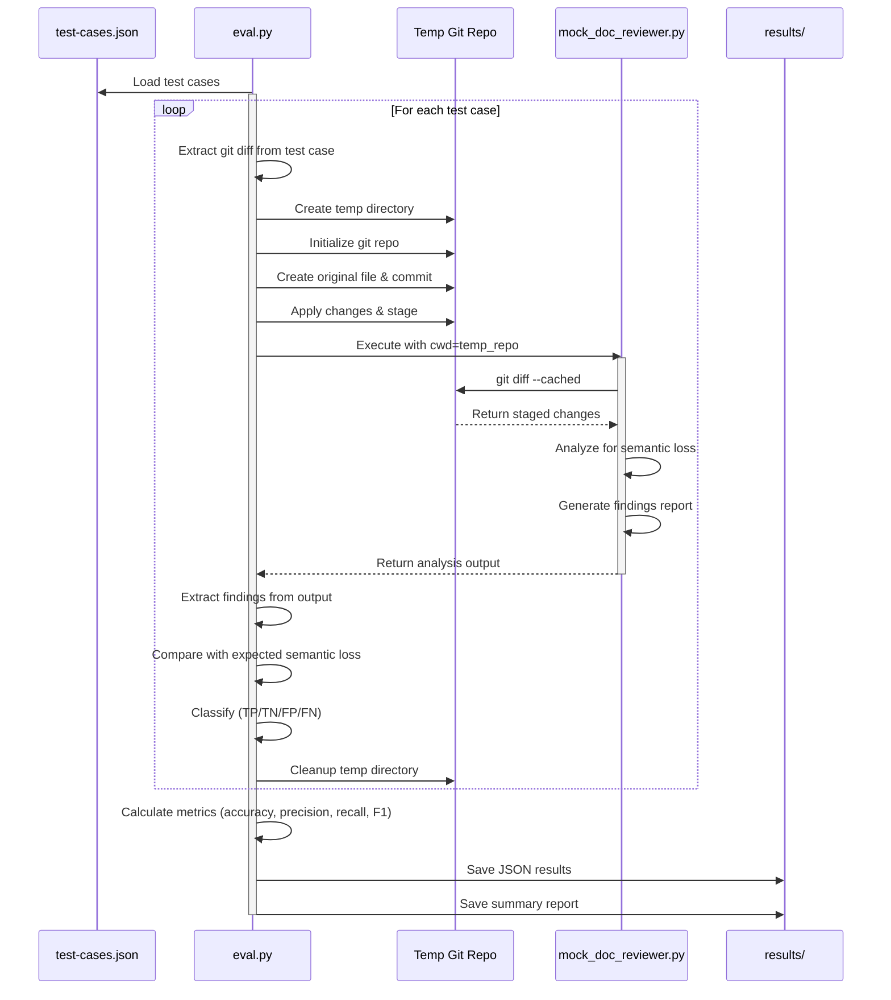

# Semantic Preservation Evaluation Framework

## Overview

This evaluation framework tests whether the `doc-reviewer` subagent correctly identifies when semantic meaning is lost in documentation changes. It focuses on **semantic preservation** rather than specific patterns, making it a generic test suite for any documentation review task.

## Philosophy

Starting without heavy frameworks allows us to:
1. Understand the fundamental problems we're solving
2. Build only what we need
3. Learn why abstractions exist before adopting them
4. Keep the solution simple and maintainable

## Structure

```
doc-reviewer/eval/
├── eval.py                         # Main evaluation runner
├── test-cases.json                 # Test cases with semantic checks
├── results/                        # Evaluation results
└── README.md                       # This file
```

## How It Works

### 1. Semantic Testing Approach

Instead of looking for specific patterns (like "table column removed"), we test whether the **meaning and capabilities** are preserved:

- **Original capabilities**: What could a user learn/do with the original documentation?
- **Modified capabilities**: What can they learn/do after the changes?
- **Semantic loss**: Is there a loss of meaning, context, or actionability?

### 2. Test Case Structure

Each test case contains:
```json
{
  "test_id": "unique_identifier",
  "description": "What this test validates",
  "git_diff": "The actual git diff to test",
  "semantic_check": {
    "original_capabilities": ["what users could do before"],
    "modified_capabilities": ["what users can do after"],
    "semantic_loss": true/false,
    "severity": "critical/warning/none"
  }
}
```

### 3. Evaluation Process

1. Create a temporary git repository with the test diff staged
2. Run the `doc-reviewer` subagent
3. Parse its output for findings
4. Compare against expected semantic loss
5. Calculate metrics (precision, recall, F1 score)

### 4. Flow Visualization



## Running the Evaluation

```bash
cd doc-reviewer/eval
python3 eval.py
```

## Metrics

The framework calculates:
- **Accuracy**: Overall correctness
- **Precision**: Of flagged issues, how many are real?
- **Recall**: Of real issues, how many were caught?
- **F1 Score**: Harmonic mean of precision and recall

## Test Cases

Current test cases cover:
1. **Table column deletion** - Loss of "Lessons" column
2. **Resource link removal** - Multiple links replaced with redirect
3. **Context removal** - Important insights deleted
4. **Successful reorganization** - Content moved but preserved

## Results

Results are saved in `results/` with:
- Detailed JSON results with all test outcomes
- Human-readable summary with metrics
- Timestamp for tracking improvements over time

## Development Roadmap

### Phase 1 ✅
- Basic Python implementation
- Mock doc-reviewer for initial testing
- 4 test cases with simple metrics

### Phase 2 (Current) ✅
- Integration with real doc-reviewer subagent
- Temporary git repository creation
- Real Claude Code CLI invocation
- Output file parsing from `tmp/doc-reviewer/`

### Phase 3 (Next Steps)
- Add 10+ more test cases
- Test edge cases and corner scenarios
- Add confidence scoring and severity mapping

### Phase 4 (Future)
- Auto-generate test variations
- Multi-model validation
- Parallel execution
- CI/CD integration

### Phase 5 (Advanced)
- Consider frameworks like EleutherAI harness
- Distributed testing
- Standardized benchmarks
- Community contributions

## Design Philosophy

1. **Transparent**: You understand every line of code
2. **Practical**: Solves real problem (doc review quality)
3. **Scalable**: Can grow as needs increase
4. **Generic**: Tests semantic preservation, not patterns
5. **Measurable**: Clear metrics for improvement

## Framework Benefits

This minimal implementation provides:
1. Understanding of evaluation framework fundamentals
2. Methods for measuring semantic preservation
3. Insights into documentation quality assessment
4. Foundation for future framework adoption

## Adding New Test Cases

1. Identify a semantic preservation scenario
2. Create a git diff that demonstrates it
3. List what capabilities are lost/preserved
4. Add to `test-cases.json`
5. Run evaluation to verify

## Dependencies

Currently minimal:
- Python 3.8+
- Standard library only
- Claude Code CLI (for running doc-reviewer)

No heavy frameworks needed initially!